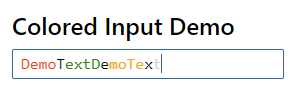

## Colored HTML Input



Sample to colorize HTML Input element text.\
This sample is based on solid-js (JSX) & tailwindcss.


### Colors can be specified per character position

```jsx
<ColoredInput
    value={...}
    onChange={...}
    colorTable={[
        { start: 0, length: 4, color: 'red' },
        { start: 5, length: 4, color: 'green' },
        { start: 10, length: 4, color: 'orange' },
        { start: 15, length: 4, color: 'lightgrey' },
    ]}
/>
```

### Run the demo

```bash
$ npm install # or pnpm install or yarn install
$ npm run dev
```
